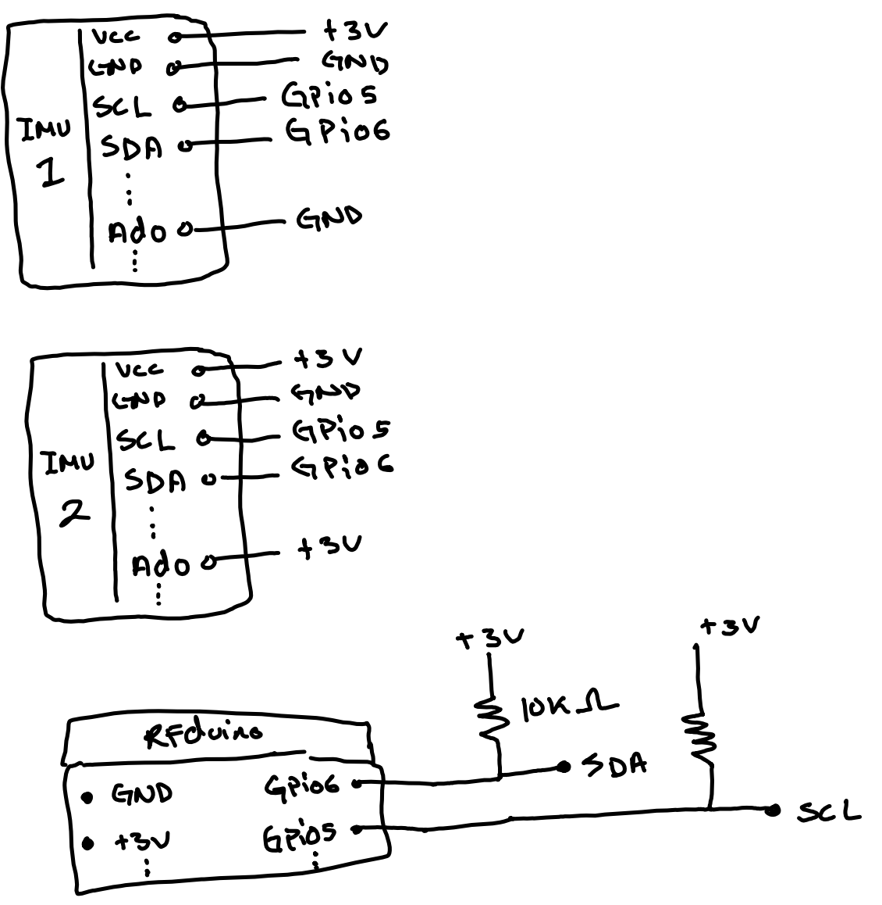

## IMU + RFduino

This directory contains example starter code for the [RFduino](https://github.com/RFduino/RFduino) microcontroller to communicate with two MPU6050 IMU chips. In addition, it contains the python connect to and read data from RFduino.

The RFDuino has all the functionalities of an Arduino while also containing an integrated bluetooth communication module.

## Installation (taken from the GitHub page for RFduino)

* Install the [FTDI drivers](http://www.ftdichip.com/Drivers/VCP.htm).

* Download [Arduino 1.6.6](http://arduino.cc/en/Main/Software) or newer.
  * _Mac OS X_: Requires Java 6 to be installed. Available [here](https://support.apple.com/kb/DL1572?locale=en_US).
  * Note: The default Package in Ubuntu 16.04 is to old 1.5.3 and does not support adding hardware support.

* Open Arduino
  * Edit Preferences (in settings), and add ```https://gist.githubusercontent.com/Alkarex/6b9a7f2e311805b6e238419e145b6c67/raw/0fa858b8c60b9cdddcce2d5c501eca3f866ed62b/package_rfduino166_index.json``` to Additional Board Manager URLs and save.
      
  * Open the Boards Manager under ```Tools->Board``` menu.
  * Select the RFduino package at the end of the list, and click Install to install it.
  * Your new board will now show up in the ```Tools->Board``` menu.

Select the board and port, and you're ready to go!

<strong>Note</strong>: Arduino may not start properly if another version has been previously installed and the Preferences are incompatible.  You can reset the Preferences by deleting the following directory:
* _Windows_: %appdata%/Arduino15 (open File Explorer, enter %appdata% into the Address Bar and press Enter)
* _Mac OS X_: ~/Library/Arduino15 (open Finder, and ```Go->Go to Folder```)
* _Linux_: ~/.arduino15

## Mac (if you have homebrew already installed you can install the drivers, arduino and java using it.)
```
brew tap homebrew/cask-drivers
brew install ftdi-vcp-driver
brew install java
brew install --cask arduino-ide
```
## Linux

```
// FTDI drivers are not needed (they are built into the kernel)

wget http://downloads.arduino.cc/arduino-1.6.6-linux64.tar.xz
tar -xf arduino-1.6.6-linux64.tar.xz

Ubuntu: sudo apt-get install default-jre
Fedora: sudo yum install jre
OpenSUSE: sudo zypper install jre

// otherwise the com port open will fail with permission denied (you must logout/login for change to take effect)
sudo usermod -aG dialout <username>
```


## Getting Started
Make sure the 2 IMUs are connected in the configuration shown below:


* Attach the USB shield

* Open ```imu_bluetooth.ino``` using Arduino

* Install ```basicMPU6050``` from the ```Tools->Manage Libraries`` menu (need this for IMU support)

* Select RFduino from the ```Tools->Board``` menu

* Select the port from the ```Tools->Port``` menu

* Select ```Upload``` to compile, upload and execute the sketch

* Once this is running, go into the python directory and run ```python3 sensor.py``` to start obtaining readings from the RFduino
